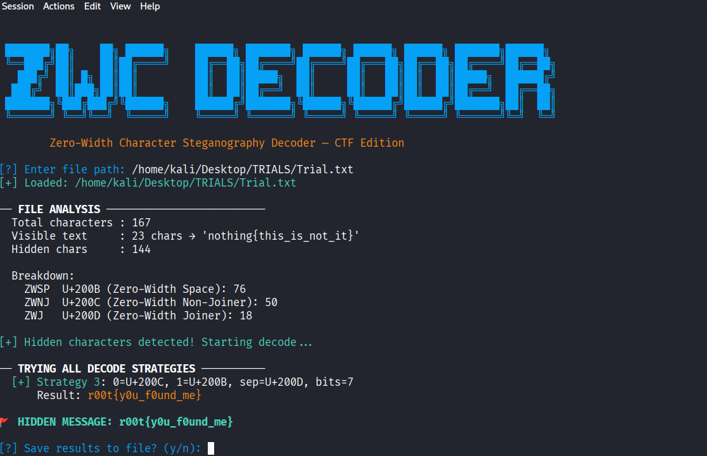

# ZWC Decoder 🔍

A Python tool for detecting and decoding **Zero-Width Character (ZWC) steganography** — commonly used in CTF (Capture The Flag) challenges.

> Hidden messages invisible to the human eye, decoded automatically.

---
## Demo


## What is ZWC Steganography?

Zero-Width Characters are real Unicode characters that render as **completely invisible** in any text editor, browser, or terminal. Attackers and CTF challenge makers use them to hide secret messages inside normal-looking text.

The three main characters used:

| Name | Unicode | UTF-8 Bytes | Role |
|---|---|---|---|
| Zero-Width Space (ZWSP) | U+200B | `E2 80 8B` | Encodes bit `0` or `1` |
| Zero-Width Non-Joiner (ZWNJ) | U+200C | `E2 80 8C` | Encodes bit `0` or `1` |
| Zero-Width Joiner (ZWJ) | U+200D | `E2 80 8D` | Separator between characters |

**Example:** The text `hello` might actually contain 200 invisible characters hiding a secret flag — and you'd never know just by looking at it.

---

## Features

- Automatically detects all zero-width characters in any file
- Tries **every possible encoding combination** so you don't have to guess
- Handles 7-bit and 8-bit ASCII encoding
- Handles files with or without separators
- Detects: U+200B, U+200C, U+200D, U+2060, U+FEFF
- Shows visible (decoy) text vs hidden character count
- Lets you pick the correct result when multiple strategies succeed
- Optionally saves results to a file
- Coloured terminal output for easy reading

---

## Requirements

- Python 3.6 or higher
- No external libraries needed — uses Python standard library only

---

## Installation

```bash
# Clone the repo
git clone https://github.com/MuneneGeo/ZWC-decoder.git

# Enter the folder
cd ZWC-decoder

# Make executable (Linux/Mac)
chmod +x zwc_decoder.py
```

---

## Usage

```bash
python3 zwc_decoder.py
```

You will be prompted to enter the file path:

```
[?] Enter file path: /home/kali/ctf/suspicious_file.txt
```

The tool then:
1. Analyses the file and reports all hidden characters found
2. Tries every decoding strategy automatically
3. Shows all readable results
4. Asks you to identify the flag
5. Optionally saves results to `zwc_results.txt`

---

## Example Output

```
[+] Loaded: not_fl4g.txt

── FILE ANALYSIS ─────────────────────────
  Total characters : 231
  Visible text     : 24 chars → 'r00t{naah_not_the_flag}'
  Hidden chars     : 207

  Breakdown:
    ZWSP  U+200B (Zero-Width Space)       : 106
    ZWNJ  U+200C (Zero-Width Non-Joiner)  : 75
    ZWJ   U+200D (Zero-Width Joiner)      : 26

[+] Hidden characters detected! Starting decode...

── TRYING ALL DECODE STRATEGIES ──────────
  [+] Strategy 3 : 0=U+200C, 1=U+200B, sep=U+200D, bits=7
      Result: r00t{H1dd3n_1n_Pl41n_S1ght}

🚩 FLAG: r00t{H1dd3n_1n_Pl41n_S1ght}
```

---

## How It Works

### Step 1 — Detect
Scans every character in the file looking for zero-width Unicode codepoints.

### Step 2 — Analyse
Reports how many of each type were found and what the visible (decoy) text says.

### Step 3 — Decode
Tries all combinations of:
- Which character represents `0` and which represents `1`
- Which character acts as a separator (or no separator)
- Whether encoding is 7-bit or 8-bit ASCII

### Step 4 — Present
Shows all readable results and lets you pick the flag.

---

## CTF Workflow on Kali Linux

```bash
# 1. If the file is inside a password-protected zip, crack it first
zip2john challenge.zip > hash.txt
john hash.txt --wordlist=/usr/share/wordlists/rockyou.txt
unzip -P <found_password> challenge.zip

# 2. Run the decoder
python3 zwc_decoder.py

# 3. Enter the extracted file path when prompted
# 4. Pick your flag from the results
```

---

## Detecting ZWC Manually (for learning)

```bash
# Method 1 — hexdump (look for e2 80 8b / 8c / 8d bytes)
hexdump -C file.txt | grep "e2 80"

# Method 2 — cat -v (shows hidden chars as symbols)
cat -v file.txt

# Method 3 — Python one-liner
python3 -c "
text = open('file.txt', encoding='utf-8').read()
for i, ch in enumerate(text):
    if ord(ch) in (0x200B, 0x200C, 0x200D):
        print(f'pos {i}: U+{ord(ch):04X}')
"
```

---

## Supported Encoding Schemes

| Scheme | Supported |
|---|---|
| ZWSP=0, ZWNJ=1, ZWJ separator | ✅ |
| ZWSP=1, ZWNJ=0, ZWJ separator | ✅ |
| No separator, 7-bit chunks | ✅ |
| No separator, 8-bit chunks | ✅ |
| Word Joiner (U+2060) as separator | ✅ |
| BOM (U+FEFF) as separator | ✅ |

---

## Contributing

Pull requests welcome. If you encounter a ZWC encoding scheme this tool doesn't handle, open an issue with an example file and I'll add support for it.

---

## License

MIT License — free to use, modify, and distribute.

---

## Author
CTF player 
 [GITHUB] https://github.com/MuneneGeo
> Built this tool while solving ZWC steganography CTF challenges.

Made for CTF steganography challenges.  
If this helped you capture a flag — give it a ⭐
